# Financial-and-Stock-Analysis
## Author
**Name:** Adham Sherif Hussein Ebaid  
**Email:** adhamebaid1@gmail.com 
## Description
This project showcases comprehensive data analysis integrating SQL, Python, and Power BI to analyze financial and stock market data. The project focuses on extracting insights from financial statements and weekly stock prices of the top companies across three key sectors: Technology, Healthcare, and Real Estate using data extracted with the yfinance API .

## Appendix
1. [Skills](#skills)
2. [Data Extraction and Preparation ](#data-extraction-and-preparation)
3. [SQL](#sql)  
   3.1 [SQL Database Schema](#sql-database-schema)  
   3.2 [Table Creation Queries](#table-creation-queries)  
   3.3 [Extracting Insights Using Queries](#extracting-insights-using-queries)

## Skills
Data Collection,Data Cleaning and Transformation,Data Visualization, Financial Analysis and KPI Calculation, SQL, Data Modeling, Power BI, DAX
## Data Extraction and Preparation 
This project utilizes financial data extracted from Yahoo Finance's API. The following steps were involved in the data extraction and preparation process:

1-**Data Source**: Yahoo Finance API  
2-**Data Extraction**:  
- Quarterly financial data (income statement and balance sheet)
- Weekly stock prices  
3-**Data Cleaning and Formatting**:  
- Handling missing values
- Renaming columns
- Creating a year_quarter column for time-based analysis
4-**Data Export**:  
The cleaned and formatted data was exported to CSV files for both SQL and Power BI:  

**For SQL:**  

- dim_companies.csv: Contains company information (ticker, name, sector).
- financial_data.csv: Contains financial metrics.
- stock_data.csv: Contains stock price data.
   
**For Power BI**:

- Financial_Data.csv: Contains financial metrics.
- Stock_Data.csv: Contains stock price data.

  ## SQL
  ### SQL Database Schema
  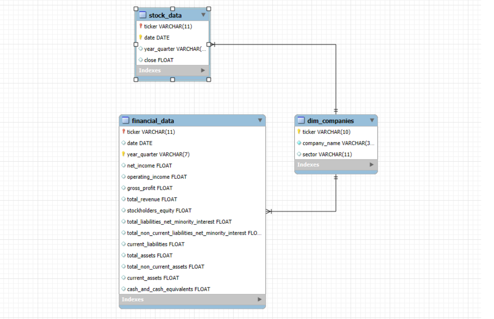
  This section outlines the SQL database schema designed to store the financial data extracted from Yahoo Finance. The schema follows a star schema design, with a central dimension table `(dim_companies)` and two fact tables `(financial_data and stock_data)`.

**Dimension Table**:  
dim_companies:
- `ticker`: Unique identifier for each company.
- `company_name`: Full name of the company.
- `sector`: Industry sector to which the company belongs.

**Fact Tables**:  
financial_data:  

- `ticker`: Foreign key referencing the ticker in dim_companies.
- `date`: Date of the financial data.
- `year_quarter`: Year and quarter of the financial data.
- `net_income`: Net income for the period.
- `operating_income`: Operating income for the period.
- `gross_profit`: Gross profit for the period.
- `total_revenue`: Total revenue for the period.
- `stockholders_equity`: Stockholders' equity for the period.
- `total_liabilities_net_minority_interest`: Total liabilities (net of minority interest) for the period.
- `total_non_current_liabilities_net_minority_interest`: Total non-current liabilities (net of minority interest) for the period.
- `current_liabilities`: Current liabilities for the period.
- `total_assets`: Total assets for the period.
- `total_non_current_assets`: Total non-current assets for the period.
- `current_assets`: Current assets for the period.
- `cash_and_cash_equivalents`: Cash and cash equivalents for the period.

stock_data:  

- `ticker`: Foreign key referencing the ticker in dim_companies.
- `date`: Date of the stock price.
- `year_quarter`: Year and quarter of the stock price.
- `close`: Closing price of the stock on the given date.

### Table Creation Queries  
**dim_companies**:  
`CREATE TABLE dim_companies(
    ticker VARCHAR(10) NOT NULL,
    company_name VARCHAR(50) NOT NULL,
    sector VARCHAR(11),
    PRIMARY KEY (ticker));`  
    **financial_data**:  
    `CREATE TABLE financial_data (
    date DATE,
    year_quarter VARCHAR(7),
    ticker VARCHAR(11),
    net_income FLOAT,
    operating_income FLOAT,
    gross_profit FLOAT,
    total_revenue FLOAT,
    stockholders_equity FLOAT,
    total_liabilities_net_minority_interest FLOAT,
    total_non_current_liabilities_net_minority_interest FLOAT,
    current_liabilities FLOAT,
    total_assets FLOAT,
    total_non_current_assets FLOAT,
    current_assets FLOAT,
    cash_and_cash_equivalents FLOAT,
    PRIMARY KEY (ticker, year_quarter),
    FOREIGN KEY (ticker) REFERENCES dim_companies(ticker)
);`  
**stock_data**:  
`CREATE TABLE stock_data (
    ticker VARCHAR(10) NOT NULL,
    date DATE,
    year_quarter VARCHAR(7),
    close FLOAT,
    PRIMARY KEY (ticker, date),
    FOREIGN KEY (ticker) REFERENCES dim_companies(ticker)
);`  

### Extracting Insights Using Queries  
**Stock Performance Overview**: 

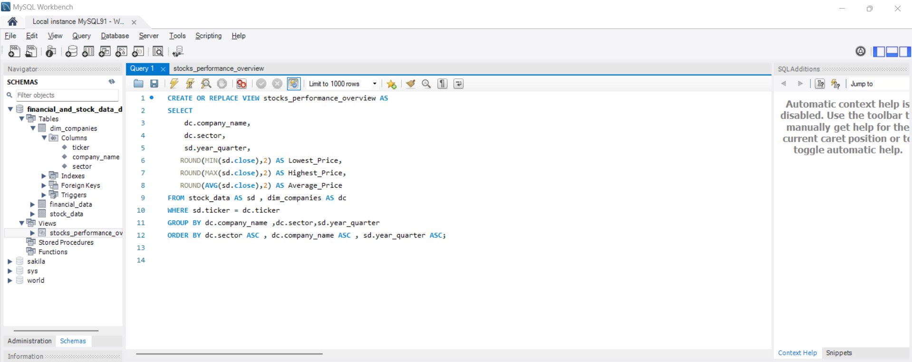  

This view aims to give an overview of each company's stock price. it shows the lowest and the highest price the stock reached and the average stock price.   

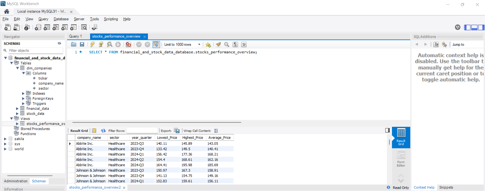  

**sector_health**: 

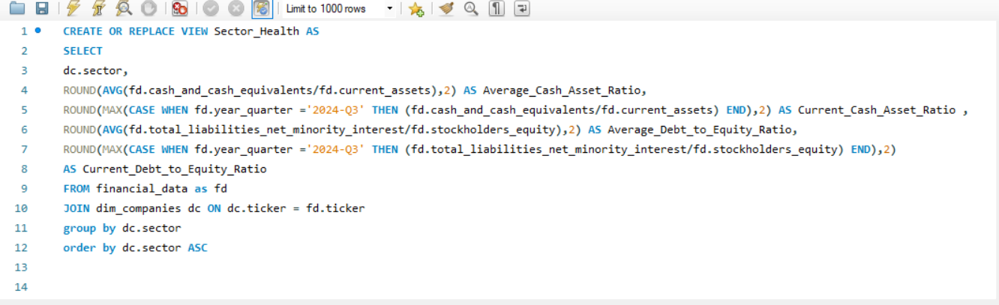 

This view displays the average/current cash to asset ratio and debt to equity ratio for every sector to get an idea about the financial health of every sector.  

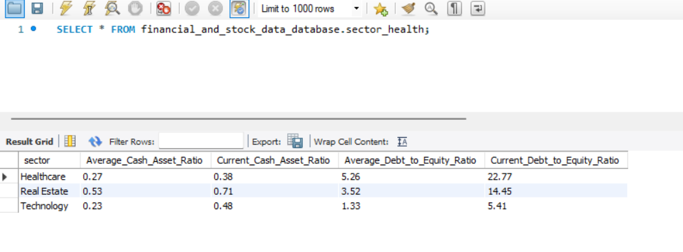  

**latest_company_kpis**:  

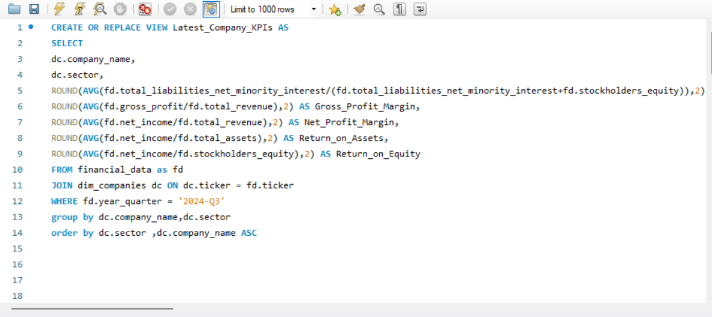  

This view shows cruical metrics to evaluate each company's financial state and help in deciding wether to buy the stocks or not.  

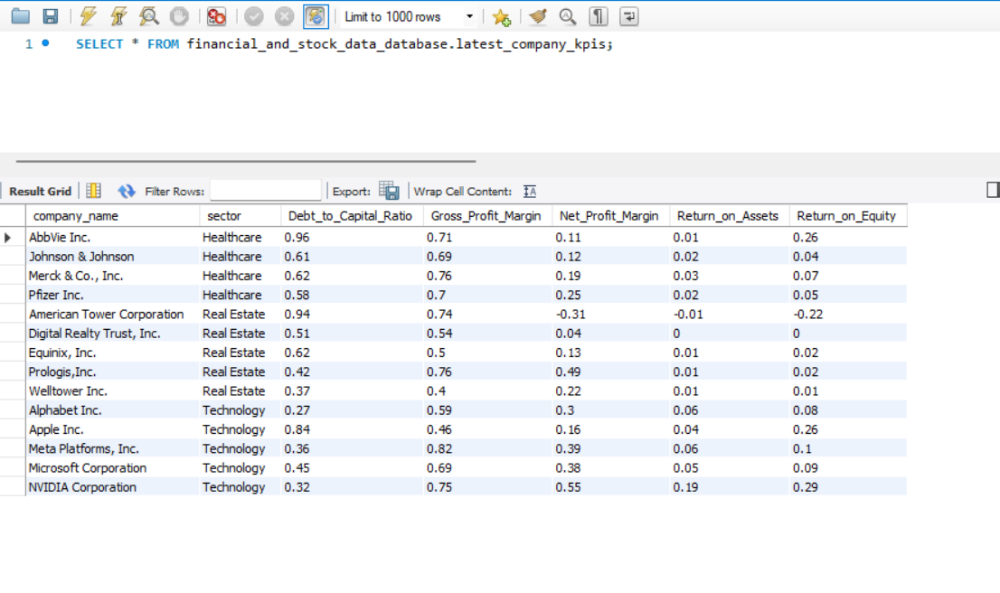  

**Cash_Asset_Ratio**:

 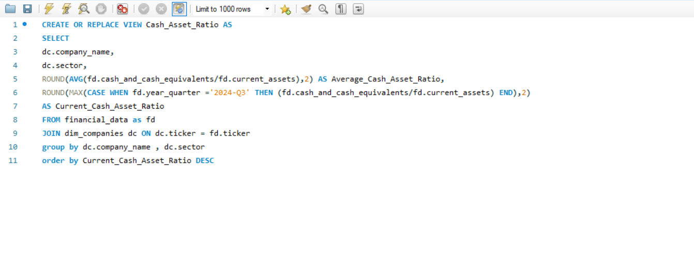  
 
This view calculates the average and current cash asset ratio for each company and sector. The `Current_Cash_Asset_Ratio` is specifically calculated for the third quarter of 2024.  

 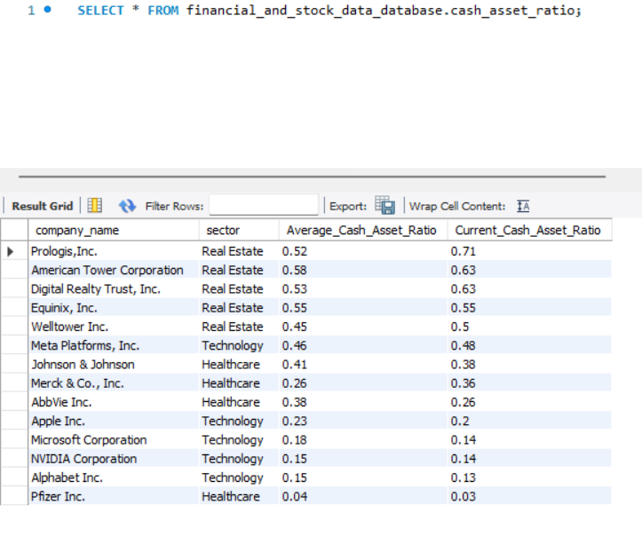  

 **volatility_analysis**:  

 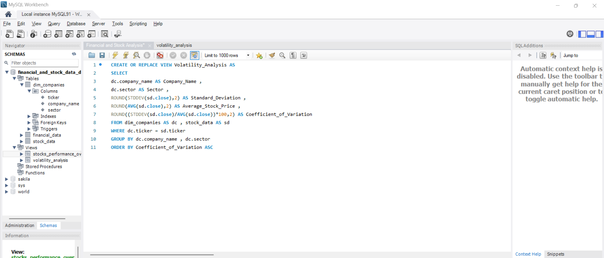  

 This view aims to show the volatility of every company's stock price or in other words , how much do the stocks change?. This is done by calculating the `Standard_Deviation` but the standard deviation is affected by the price of the stock itself so it might not give an accurate indication of what we are trying to understand hence why the view calculates and shows the `Average_Stock_Price` and the `Coeffecient_of_Variation` which is the standard deviation divided by the average stock price and shown as a precentage.  

 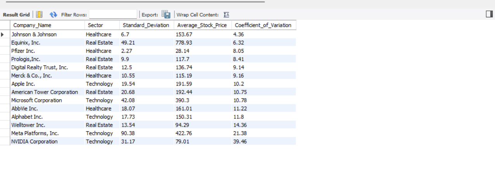  

 **debt_to_equity_ratio**:  

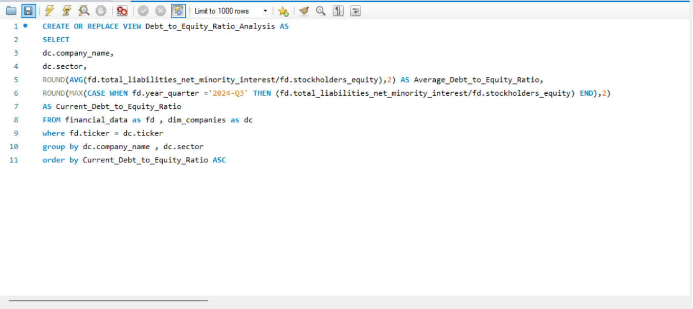   

 This view shows the debt to equity ratio of every company. The D/E ratio is an important metric in corporate finance. It is a measure of the degree to which a company is financing its operations with debt rather than its own resources.  

 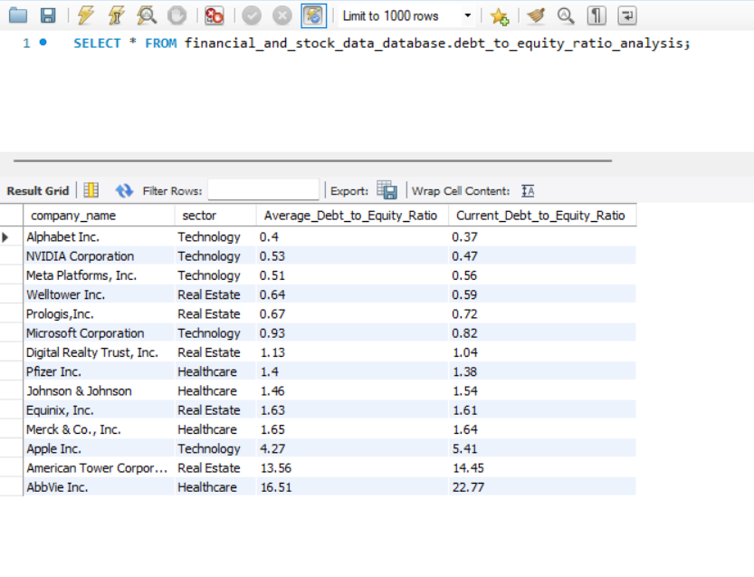  

## Power BI Report  

 
 
 

    

     

 
 

 
    

  
  
  
  
